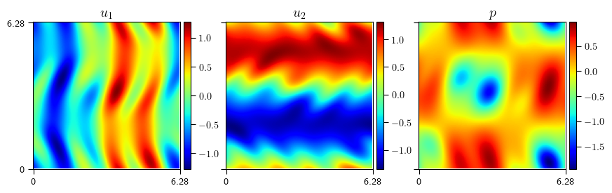

# Flow Reconstruction

Reconstructing 3D wake behind a bluff body with sparse sensor measurements. 

### Publications:

*Mo, Y., Magri, L., 2025. *Reconstructing unsteady flows from sparse, noisy measurements with a physics-constrained convolutional neural network*. Phys. Rev. Fluids 10, 034901. https://doi.org/10.1103/PhysRevFluids.10.034901

\*Go to branch `paper/flow-reconstruction-2d`.

## Stage 1

Reconstruct the 2D flow behind a triangular shape, only limited amount of data is made available in training of the network.

The flow is simulated with [XCompact3D](https://github.com/xcompact3d/Incompact3d), where a triangular cylinder was placed between two slip walls.
Streamwise and wall-normal velocities, together with pressure are recorded. Spanwise velocity is $0$ in the computational domain. 
Pressure measurement at the base of the triangle are used as input to the network. 
The networks training methods are derived from [PISR](https://github.com/MagriLab/PISR), a method for physics-informed super-resolution by Kelshaw, Rigas and Magri (2022).

*Example of the generated wake behind a triangular shape.*

## Stage 2
Reconstruct 2D Kologorov flow from noisy, sparse sensors.

The Kolmogorov flows are generated using [KolSol](https://github.com/MagriLab/KolSol/). 
Also starting from pressure measurements, and using sparse velocity & pressure measurements as collocation points. White noise are added to the measurements before training.

<!-- -->

*An example of the mean of a 2D Kolmogorov flow.*

## Stage 3 
Reconstruction of 3D Kolmogorv flow. TBC