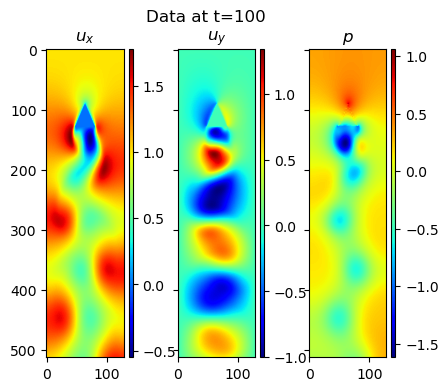

# Flow Reconstruction

Reconstructing 3D wake behind a bluff body with limited amount of sensors. 

## Major changes

28 Mar 2025: The current config file is no longer compatible with the old training script starting from commit `e60831b779e301e9a3b5f88c0d43d4e47ba1455a`. 

## Stage 1

Reconstruct the 2D flow behind a triangular shape, only limited amount of data is made available in training of the network.

The flow is simulated with [XCompact3D](https://github.com/xcompact3d/Incompact3d), where a triangular cylinder was placed between two slip walls.
Streamwise and wall-normal velocities, together with pressure are recorded. Spanwise velocity is $0$ in the computational domain. 
Pressure measurement at the base of the triangle are used as input to the network. 
The networks training methods are derived from [PISR](https://github.com/MagriLab/PISR), a method for physics-informed super-resolution by Kelshaw, Rigas and Magri (2022).

*Example of the generated wake behind a triangular shape.*